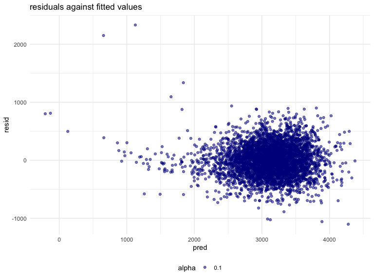
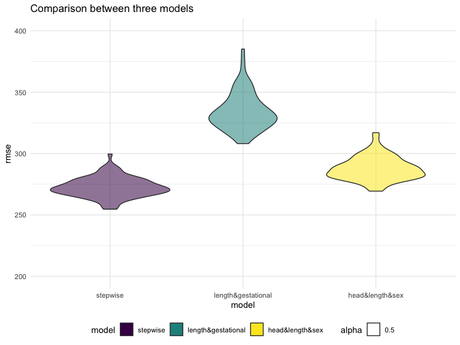
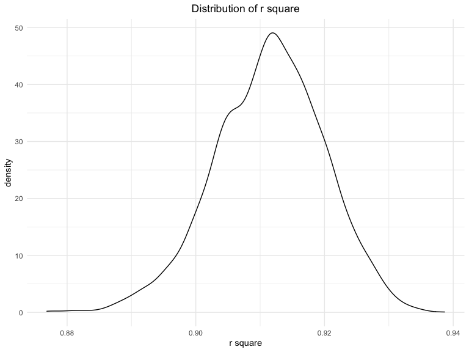
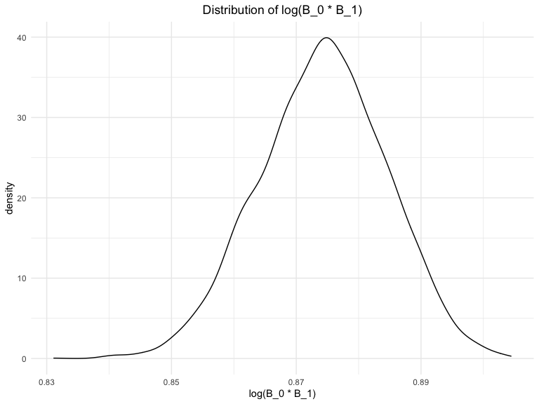

p8105\_hw6\_js5962
================
Jiayao Sun

    ## ── Attaching packages ─────────────────────────────────────── tidyverse 1.3.1 ──

    ## ✓ ggplot2 3.3.5     ✓ purrr   0.3.4
    ## ✓ tibble  3.1.4     ✓ dplyr   1.0.7
    ## ✓ tidyr   1.1.3     ✓ stringr 1.4.0
    ## ✓ readr   2.0.1     ✓ forcats 0.5.1

    ## ── Conflicts ────────────────────────────────────────── tidyverse_conflicts() ──
    ## x dplyr::filter() masks stats::filter()
    ## x dplyr::lag()    masks stats::lag()

    ## Loading required package: viridisLite

    ## Loading required package: nlme

    ## 
    ## Attaching package: 'nlme'

    ## The following object is masked from 'package:dplyr':
    ## 
    ##     collapse

    ## This is mgcv 1.8-36. For overview type 'help("mgcv-package")'.

    ## 
    ## Attaching package: 'MASS'

    ## The following object is masked from 'package:dplyr':
    ## 
    ##     select

## Problem 1

Import and clean the data

``` r
race = c("White", "Black", "Asian", "Puerto_Rican", "Other", "Unkown") 
birthweight_df = 
  read_csv("birthweight.csv") %>%
  #convert numeric to factor
  mutate(
    babysex = factor(recode(babysex, `1` = "male", `2` = "female")),
    malform = factor(recode(malform, `0` = "absent", `1` = "present")),
    frace = factor(race[frace]),
    mrace = factor(race[mrace])
  ) %>%
  #pnumlbw = 0, pnumsga = 0
  dplyr::select(-pnumlbw, -pnumsga) %>% 
  #check for missing data
  drop_na()
```

To find out a fittest regression model, I would use stepwise regression
here, for both forward and backward selection.p value should be smaller
than 0.05.

``` r
# fit regression using all predictors
mult_fit = lm(bwt ~ ., data = birthweight_df)
summary(mult_fit)
```

    ## 
    ## Call:
    ## lm(formula = bwt ~ ., data = birthweight_df)
    ## 
    ## Residuals:
    ##      Min       1Q   Median       3Q      Max 
    ## -1095.36  -185.10    -3.52   172.82  2337.49 
    ## 
    ## Coefficients: (1 not defined because of singularities)
    ##                     Estimate Std. Error t value Pr(>|t|)    
    ## (Intercept)       -6333.6118   660.0659  -9.595  < 2e-16 ***
    ## babysexmale         -28.5056     8.4778  -3.362 0.000779 ***
    ## bhead               130.9757     3.4577  37.879  < 2e-16 ***
    ## blength              74.7650     2.0248  36.925  < 2e-16 ***
    ## delwt                 4.1312     0.3953  10.450  < 2e-16 ***
    ## fincome               0.2808     0.1798   1.561 0.118497    
    ## fraceBlack           24.7189    80.8446   0.306 0.759804    
    ## fracePuerto_Rican   -56.0447    79.6917  -0.703 0.481926    
    ## fraceWhite          -16.3253    70.7956  -0.231 0.817638    
    ## gaweeks              11.4763     1.4672   7.822 6.49e-15 ***
    ## malformpresent        9.2318    70.6228   0.131 0.896002    
    ## menarche             -3.6891     2.8983  -1.273 0.203133    
    ## mheight              10.3153    10.3249   0.999 0.317820    
    ## momage                0.8213     1.2238   0.671 0.502190    
    ## mraceBlack          -94.4173    83.7435  -1.127 0.259612    
    ## mracePuerto_Rican    20.3459    82.8938   0.245 0.806124    
    ## mraceWhite           84.3308    74.3061   1.135 0.256476    
    ## parity               95.1806    40.4779   2.351 0.018747 *  
    ## ppbmi                 5.2452    14.9130   0.352 0.725067    
    ## ppwt                 -3.6470     2.6159  -1.394 0.163345    
    ## smoken               -4.8486     0.5887  -8.237 2.33e-16 ***
    ## wtgain                    NA         NA      NA       NA    
    ## ---
    ## Signif. codes:  0 '***' 0.001 '**' 0.01 '*' 0.05 '.' 0.1 ' ' 1
    ## 
    ## Residual standard error: 272.5 on 4307 degrees of freedom
    ## Multiple R-squared:  0.7184, Adjusted R-squared:  0.717 
    ## F-statistic: 549.3 on 20 and 4307 DF,  p-value: < 2.2e-16

``` r
#use one function
Finalstep = stepAIC(mult_fit, direction = 'both', trace = FALSE, k =  3.8415)
summary(Finalstep)  
```

    ## 
    ## Call:
    ## lm(formula = bwt ~ babysex + bhead + blength + delwt + gaweeks + 
    ##     mheight + mrace + parity + ppwt + smoken, data = birthweight_df)
    ## 
    ## Residuals:
    ##      Min       1Q   Median       3Q      Max 
    ## -1103.63  -183.58    -2.43   174.32  2332.43 
    ## 
    ## Coefficients:
    ##                     Estimate Std. Error t value Pr(>|t|)    
    ## (Intercept)       -6136.7664   142.2020 -43.155  < 2e-16 ***
    ## babysexmale         -28.1832     8.4706  -3.327 0.000885 ***
    ## bhead               131.1548     3.4505  38.011  < 2e-16 ***
    ## blength              74.6054     2.0215  36.906  < 2e-16 ***
    ## delwt                 4.1201     0.3926  10.495  < 2e-16 ***
    ## gaweeks              11.6099     1.4638   7.931 2.74e-15 ***
    ## mheight               6.7687     1.7827   3.797 0.000149 ***
    ## mraceBlack          -72.5126    42.8344  -1.693 0.090554 .  
    ## mracePuerto_Rican   -32.6457    45.8082  -0.713 0.476095    
    ## mraceWhite           73.9051    42.8120   1.726 0.084370 .  
    ## parity               94.5681    40.3439   2.344 0.019121 *  
    ## ppwt                 -2.6690     0.4278  -6.239 4.84e-10 ***
    ## smoken               -4.8707     0.5874  -8.292  < 2e-16 ***
    ## ---
    ## Signif. codes:  0 '***' 0.001 '**' 0.01 '*' 0.05 '.' 0.1 ' ' 1
    ## 
    ## Residual standard error: 272.4 on 4315 degrees of freedom
    ## Multiple R-squared:  0.7179, Adjusted R-squared:  0.7171 
    ## F-statistic:   915 on 12 and 4315 DF,  p-value: < 2.2e-16

Therefore, we choose babysexmale, bhead, blength, delwt, gaweeks,
mheight, mrace, parity, ppwt and smoken as the significant factors.

Then show a plot of model residuals against fitted values.

``` r
birthweight_df %>% 
  add_predictions(Finalstep) %>% 
  add_residuals(Finalstep) %>% 
  ggplot(aes(x = pred, y = resid, alpha = 0.1)) +
  geom_point(color = "darkblue") +
  ggtitle("residuals against fitted values")
```



Sample

``` r
birthweight_cv =
  crossv_mc(birthweight_df, 80) %>% 
  mutate(
    train = map(train, as_tibble),
    test = map(test, as_tibble)
  )
```

Next, Fit and compare the models

``` r
fit_df =
  birthweight_cv %>% 
  mutate(
    Finalstep = 
      map(.x = train, ~stepAIC(lm(bwt ~ ., data = .x), direction = "both", trace = FALSE)),
    bl_ges = map(.x = train, ~lm(bwt ~ blength + gaweeks, data = .x)),
    bh_bl_sex = map(.x = train, ~lm(bwt ~ bhead + blength + babysex + bhead * blength + bhead * babysex + blength * babysex + bhead * blength * babysex, data = .x))
  ) %>% 
  mutate(
    rmsefinal = map2_dbl(.x = Finalstep,.y = test, ~rmse(model = .x, data = .y)),
    rmsebl = map2_dbl(.x = bl_ges,.y = test, ~rmse(model = .x, data = .y)),
    rmsebh = map2_dbl(.x = bh_bl_sex,.y = test, ~rmse(model = .x, data = .y))
  )
```

Then we can draw the plot.

``` r
fit_df %>% 
  dplyr::select(starts_with("rmse")) %>% 
  pivot_longer(
    rmsefinal:rmsebh,
    names_to = "model",
     values_to = "rmse", 
     names_prefix = "rmse"
   ) %>%
   mutate(
     model = fct_inorder(model)
     ) %>% 
  ggplot(aes(x = model, y = rmse, fill = model, alpha = 0.5)) +
  geom_violin() +
  scale_x_discrete(labels = c("stepwise", "length&gestational", "head&length&sex")) +
  ggtitle("Comparison between three models") +
  scale_fill_discrete(labels = c("stepwise", "length&gestational", "head&length&sex")) +
  ylim(200, 400)
```



## Problem 2

Firstly, we import the weather data by chunk given.

``` r
weather_df = 
  rnoaa::meteo_pull_monitors(
    c("USW00094728"),
    var = c("PRCP", "TMIN", "TMAX"), 
    date_min = "2017-01-01",
    date_max = "2017-12-31") %>%
  mutate(
    name = recode(id, USW00094728 = "CentralPark_NY"),
    tmin = tmin / 10,
    tmax = tmax / 10) %>%
  dplyr::select(name, id, everything())
```

Do the bootstrap

``` r
weather_boot =
  weather_df %>% 
  bootstrap(n = 5000) %>% 
  mutate(
    model = map(.x = strap, ~lm(tmax ~ tmin, data = .x)),
    result_r = map(model, broom::glance),
    result_log = map(model, broom::tidy)
   ) %>% 
  dplyr::select(.id, result_r, result_log) %>% 
  unnest(result_r, result_log)
```

Firstly, let’s calculate the r square.

``` r
r_square =
  weather_boot %>% 
  filter(term == "tmin") %>% 
  dplyr::select(r.squared) 
```

Then, make the density plot for r square.

``` r
r_square %>% 
  ggplot(aes(x = r.squared)) +
  geom_density() + 
  xlab("r square") +
  ggtitle("Distribution of r square") +
  theme(plot.title = element_text(hjust = 0.5))
```



The density plot of r square is nearly a normal distribution with
average rounding 0.912. It is slightly left skewed because the right
side decreases in a steeper line. Since r square is near to 1, the model
would fit the data.

For 95% confidence interval.

``` r
r_square %>% 
  summarize(
    "2.5%" = quantile(r.squared, 0.025),
    "97.5%" = quantile(r.squared,0.975)
  ) %>% 
  knitr::kable()
```

|      2.5% |     97.5% |
|----------:|----------:|
| 0.8935844 | 0.9272475 |

Then we calculate the *l**o**g*(*β*<sub>0</sub> \* *β*<sub>1</sub>)

``` r
log_cal =
  weather_boot %>% 
  dplyr::select(.id, term, estimate) %>% 
  pivot_wider(names_from = term,
              values_from = estimate) %>% 
  rename(intercept = "(Intercept)") %>% 
  mutate(
    log = log10(intercept*tmin)
    )
```

Make a density plot for *l**o**g*(*β*<sub>0</sub> \* *β*<sub>1</sub>)

``` r
log_cal %>% 
  ggplot(aes(x = log)) +
  geom_density() + 
  xlab("log(B_0 * B_1)") +
  ggtitle("Distribution of log(B_0 * B_1)") +
  theme(plot.title = element_text(hjust = 0.5))
```



We can see from the plot that the distribution of
*l**o**g*(*β*<sub>0</sub> \* *β*<sub>1</sub>) approaches to the normal
distribution, but slightly left-skewed. The highest density is around
0.876.

Then, find the 95% confidence interval.

``` r
log_cal %>% 
  summarize(
    "2.5%" = quantile(log, 0.025),
    "97.5%" = quantile(log,0.975)
  ) %>% 
  knitr::kable()
```

|      2.5% |     97.5% |
|----------:|----------:|
| 0.8539263 | 0.8933647 |
